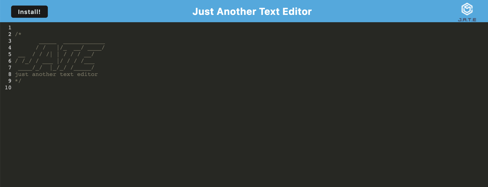

# Text editor

## Description
This project allows you to capture and save text in an editor that can be used online or offline. 

The application contains the following:
* Text editor
* Browser based application
* Installable application




## Built with
* JavaScript in a PWA
* Webpack

## Getting started
### Prerequisites
* Install devDependencies 
* Install dependencies

### Installation
To clone the repo, follow the instructions by following the instructions at [cloning a repository](https://docs.github.com/en/repositories/creating-and-managing-repositories/cloning-a-repository) or follow the instructions below

1. Open Terminal
2. Change the current working directory to the location where you want the cloned directory
3. Type git clone, and then paste the URL you copied earlier
```
$ git clone https://github.com/RachelHarris90/text-editor.git
```
4. Press Enter


## Credits
The author of this repo is Rachel Harris, a student of Trilogy Developer Bootcamp.

## License
MIT.

## Tests
The code in this repo is not currently covered with automated tests.